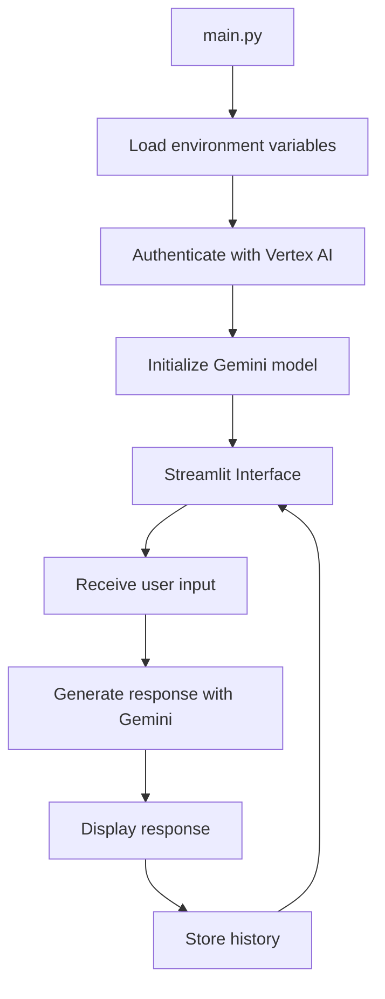

# Vertex AI Chat Demo 🧠

Streamlit application that integrates with Google Cloud's Vertex AI, using the Gemini 1.0 Pro model to create a local chat interface.

## 🚀 Technologies Used

- **Streamlit**: Web interface framework
- **Vertex AI**: Google Cloud's AI platform
- **Gemini 1.0 Pro**: Advanced language model
- **Python-dotenv**: Environment variables management

## ⚙️ Setup

1. Clone the repository:
```bash
git clone https://github.com/your-user/vertex-ai-demo.git
```

2. Install dependencies:
```bash
pip install -r requirements.txt
```

3. Configure Google Cloud credentials:
```bash
gcloud auth application-default login
```

4. Create the `.env` file with your credentials:
```env
PROJECT_ID="your-project-id"
REGION="your-region"
```

## ▶️ Running the Application

To run the application:
```bash
streamlit run main.py
```

## 🎯 Features

- Modern and responsive interface
- Persistent chat history
- Direct integration with Vertex AI
- Gemini 1.0 Pro model usage
- Advanced error handling
- Custom CSS styles
- Visual feedback during processing

## 📊 Project Architecture



## 🖼️ Interface Screenshot


## 📚 Learnings

- Vertex AI integration
- Generative models usage
- Streamlit interface creation
- Environment variables management
- MLOps best practices

## 📝 License

This project is licensed under the MIT License - see the [LICENSE](LICENSE) file for details.


