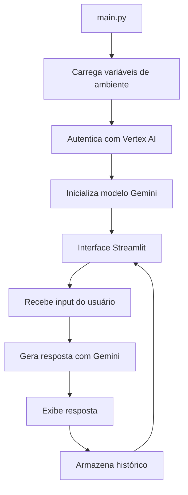

# Vertex AI Local Demo 🧠

Aplicação Streamlit que integra com o Vertex AI da Google Cloud, utilizando o modelo Gemini 1.0 Pro para criar uma interface de chat local.

## 🚀 Tecnologias Utilizadas

- **Streamlit**: Framework para criação de interfaces web
- **Vertex AI**: Plataforma de IA da Google Cloud
- **Gemini 1.0 Pro**: Modelo de linguagem avançado
- **Python-dotenv**: Gerenciamento de variáveis de ambiente

## ⚙️ Configuração

1. Clone o repositório:
```bash
git clone https://github.com/seu-usuario/vertex-ai-demo.git
```

2. Instale as dependências:
```bash
pip install -r requirements.txt
```

3. Configure as credenciais do Google Cloud:
```bash
gcloud auth application-default login
```

4. Crie o arquivo `.env` com suas credenciais:
```env
PROJECT_ID="seu-project-id"
REGION="sua-regiao"
```

## ▶️ Execução

Para rodar a aplicação:
```bash
streamlit run main.py
```

## 🎯 Funcionalidades

- Interface moderna e responsiva
- Histórico de conversas persistente
- Integração direta com Vertex AI
- Utilização do modelo Gemini 1.0 Pro
- Tratamento avançado de erros
- Estilos CSS customizados
- Feedback visual durante o processamento

## 📊 Arquitetura do Projeto



## 🖼️ Screenshot da Interface


## 📚 Aprendizados

- Integração com Vertex AI
- Uso de modelos generativos
- Criação de interfaces com Streamlit
- Gerenciamento de variáveis de ambiente
- Boas práticas de MLOps

## 📝 Licença

Este projeto está licenciado sob a MIT License - veja o arquivo [LICENSE](LICENSE) para detalhes.


